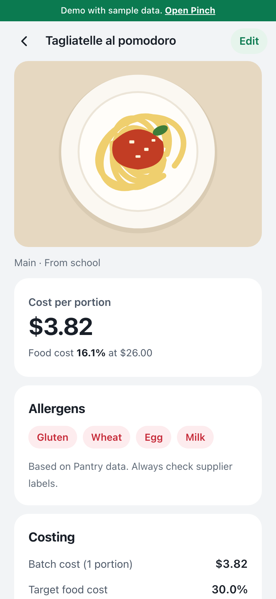
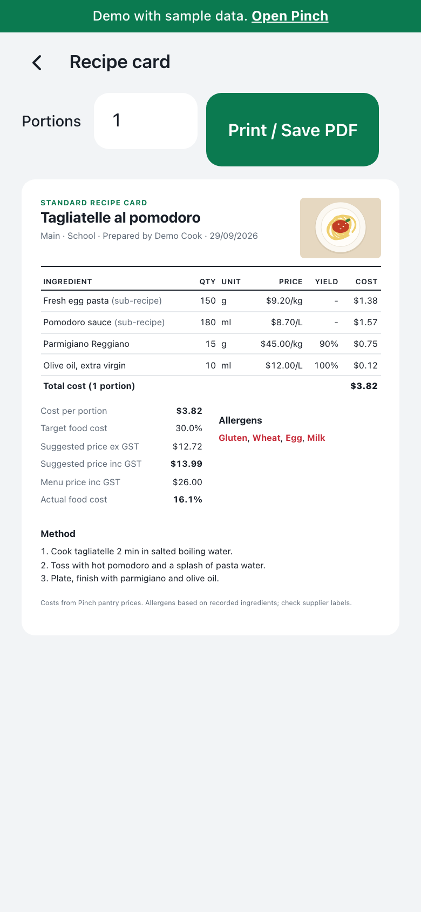
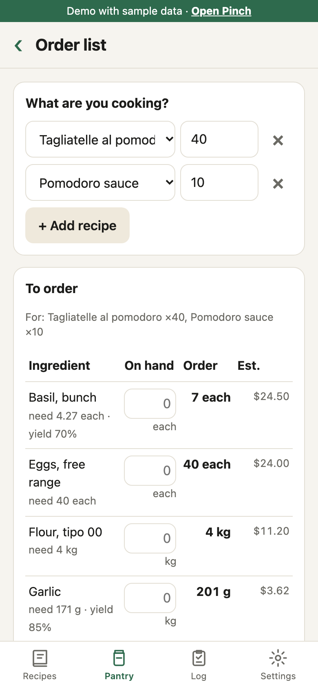
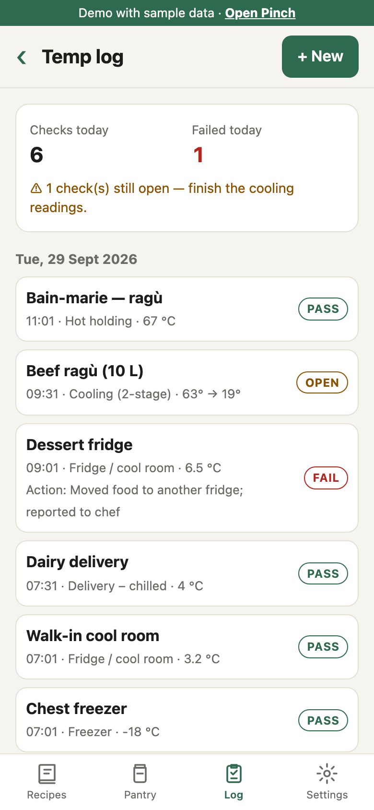
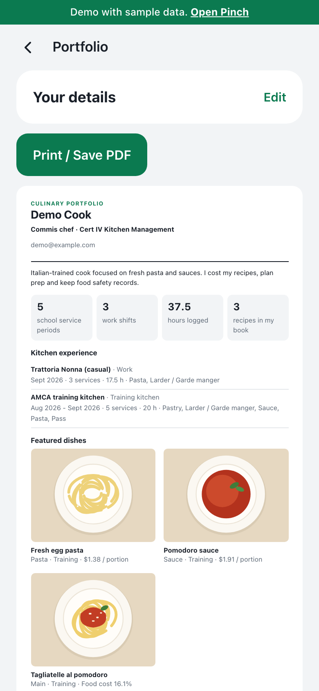
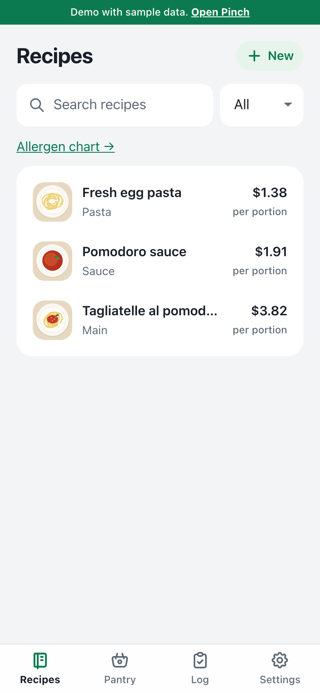

# Pinch

**A pocket kitchen notebook for cooks** — recipes, food costing, allergens, ordering, food safety records and a service log, in one installable app that works offline.

**[Open the app](https://jblee3030.github.io/pinch/)** · **[Try the demo with sample data](https://jblee3030.github.io/pinch/?demo)**

<table>
  <tr>
    <td></td>
    <td></td>
    <td></td>
  </tr>
  <tr>
    <td align="center">Recipe costing &amp; allergens</td>
    <td align="center">Costed recipe card (PDF)</td>
    <td align="center">Order list</td>
  </tr>
  <tr>
    <td></td>
    <td></td>
    <td></td>
  </tr>
  <tr>
    <td align="center">Temperature log</td>
    <td align="center">Portfolio (PDF)</td>
    <td align="center">Recipe book</td>
  </tr>
</table>

## Why

I built Pinch while studying Commercial Cookery and Kitchen Management in Melbourne. Cooks keep recipes in notebooks, cost them in spreadsheets, write orders on paper and log fridge temperatures on clipboards. Pinch puts all of that in the phone that's already in your pocket, built around how an Australian commercial kitchen works: GST-inclusive menu prices, trim yield, FSANZ allergen declarations and food safety temperature limits.

## Features

**Recipes & costing**
- Recipe book with photos, method and scaling to any number of portions
- Sub-recipes (a sauce or dough inside a dish) by portion or by weight/volume; cost and allergens roll up through every level, and circular references are blocked
- Cost per portion, suggested menu price from a target food cost %, actual food cost % against the menu price (GST-aware)
- Pantry of ingredient prices per kg / L / each with trim yield %; type a new ingredient straight into a recipe and price it later — missing prices are flagged, never counted as $0
- Costed standard recipe card, printable to A4 / PDF
- Paste a whole ingredient list: quantities, fractions and units are read (Australian cup / tbsp / tsp), names are matched to the Pantry
- Import supplier price lists from CSV or a spreadsheet; pack prices (5kg bag, dozen, 500g) become price per kg / L / each

**Kitchen operations**
- Order list: choose recipes and portions → sub-recipes expand to raw ingredients, grossed up for trim yield, minus stock on hand, with estimated cost; share as text or print
- Allergen chart across all recipes (Australian mandatory allergens)
- Food safety temperature log: fridge, freezer, deliveries, hot holding, cooking and 2-stage cooling (60 → 21 °C within 2 h → 5 °C within 6 h), each marked PASS / FAIL / OPEN with corrective actions

**Career**
- Service log for training-kitchen service periods and work shifts (station, hours, dishes, chef feedback) with progress toward the course requirement
- Portfolio page generated from the log and featured dishes, printable to PDF

**Data**
- Works offline; data lives on the device
- Optional account: email + password sign-in syncs across devices, with in-app password reset
- First-run guide, in-app feedback and a share link for inviting classmates
- JSON backup export / import

## How it's built

| | |
|---|---|
| **Frontend** | Vanilla JavaScript (ES modules), HTML and CSS — no framework, no build step, no runtime dependencies. ~1,300 lines of app code. |
| **App shell** | Installable PWA with a network-first service worker: always fresh online, fully usable offline. |
| **Storage** | IndexedDB is the source of truth (local-first). Schema upgrades only add stores, so existing data is never touched. |
| **Sync** | Supabase (Postgres) through its REST API. One `items` table protected by row-level security. Each device pushes changed rows and pulls rows past its own cursor; deletes are tombstones; conflicts resolve last-edit-wins on both client and server (a Postgres trigger rejects older writes). Schema: [`supabase.sql`](supabase.sql). |
| **Costing engine** | Pure functions in [`calc.js`](calc.js): unit conversion, recursive sub-recipe costing with cycle detection, order quantities, food safety rules. |
| **Parsing** | [`parse.js`](parse.js): ingredient-line parser (fractions, ranges, `2 x 400g`, AU measures), word-based matching to the Pantry, CSV/TSV price lists with pack-size conversion. |
| **Tests** | `node calc.test.js` — assertion-based checks for costing, sub-recipes, circular references, order lists, stock on hand, temperature limits, sync conflict rules, and recipe / price-list parsing. |
| **Hosting** | GitHub Pages; every push to `main` deploys. |

```
index.html   app shell and tab bar
app.js       screens and routing
calc.js      costing, ordering and food safety rules (pure, tested)
parse.js     pasted recipes and supplier price lists (pure, tested)
db.js        IndexedDB storage, change tracking, backup
sync.js      optional Supabase auth and sync
sw.js        offline support
```

## Run locally

No install needed.

```
python3 -m http.server 8000     # then open http://localhost:8000
node calc.test.js
```

Add `?demo` to the URL to open a separate database filled with sample data.

## Roadmap

- Custom email delivery (SMTP) so reset emails reach every user
- Sharing with classmates and a teacher view of service logs
- App Store / Play Store packaging
